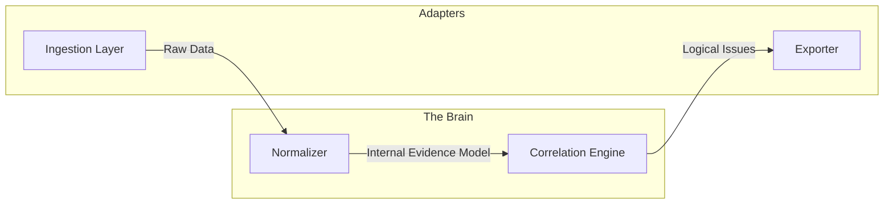

# secfacts

**High-Performance Security Evidence Normalization & Correlation Engine**

[](https://github.com/secfacts/secfacts/releases)
[](https://opensource.org/licenses/Apache-2.0)
[](https://goreportcard.com/report/github.com/secfacts/secfacts)

`secfacts` is a specialized engineering tool designed to combat **Security Alert Fatigue**. It transforms thousands of raw, disparate security findings from SAST, DAST, SCA, and Cloud scanners into a handful of actionable, correlated logical issues.

---

## ⚡ Why secfacts?

In modern DevSecOps pipelines, individual scanners (Trivy, Grype, Gitleaks, Checkov) often report redundant or logically related findings. A single outdated base image can trigger 50+ vulnerabilities, while a misconfigured S3 bucket might trigger both a "Public Access" warning and a "Sensitive Data Leak" alert.

`secfacts` solves this by:
- **Sharded Actor Correlation:** Utilizing a lock-free, concurrent engine to deduplicate and group findings with near-zero overhead.
- **Context-Aware Scoring:** Dynamically increasing severity scores when multiple risk vectors (e.g., a vulnerability *and* an exposure) converge on the same asset.
- **Root-Cause Aggregation:** Shifting the focus from "Fix 1,000 Alerts" to "Upgrade 3 Packages and Review 2 IAM Policies."

---

## 🏗️ Architecture

`secfacts` follows a strict **Clean Architecture (Hexagonal)** pattern to ensure the core logic remains independent of input sources and output formats.



1.  **Ingest:** Stream-decode massive SARIF/JSON files using zero-copy principles.
2.  **Normalize:** Deduplicate identical findings from disparate tools using deterministic hashing.
3.  **Correlate:** Group findings by resource and compute weighted severity scores.
4.  **Export:** Generate actionable Markdown reports or high-impact terminal summaries.

---

## 🚀 Quick Start

### Installation

```bash
# Build from source
make build
sudo make install
```

### Run a Scan

Normalize a SARIF report and generate a Markdown summary:

```bash
secfacts scan -i examples/complex.sarif -o report.md
```

### CI/CD Integration

Fail the build if any high-severity issue (score >= 7.0) is detected:

```bash
secfacts scan -i report.sarif --fail-on high
```

---

## 📊 Performance

Designed for enterprise-scale datasets:
- **Streaming Ingestion:** Processes 1GB+ SARIF files without memory spikes using `encoding/json` Stream Decoders.
- **Lock-Free Concurrency:** The Sharded Actor model enables high-speed processing on multi-core systems without mutex contention.
- **Zero-Copy Philosophy:** Minimizes allocations and GC pressure by utilizing byte slices and pointers throughout the pipeline.

---

## 🎯 Real-World Impact

### Before secfacts
> **114 Alerts Detected**
> - 102 CVEs in `spring-core` (Trivy, Grype)
> - 10 Public Access Warnings (Checkov)
> - 2 Leaked Secrets (Gitleaks)

### After secfacts
> **3 Logical Issues Identified**
> 1. **[CRITICAL] Exposed Vulnerable Asset:** `prod-assets-public` (Publicly exposed S3 bucket with leaked AWS keys).
> 2. **[HIGH] Dependency Upgrade:** Upgrade `spring-core` to v6.1.4 (Resolves 102 CVEs).
> 3. **[MEDIUM] Infrastructure Misconfiguration:** Review IAM policies for `prod-db-snapshot`.

---

## 📄 License

Distributed under the Apache License 2.0. See `LICENSE` for more information.

---

## ☕ Support the Project

If `secfacts` saved you hours of triage, consider supporting the maintenance of this tool:

[](https://www.buymeacoffee.com/mutasem_mk4)

---

## 🛠️ Maintainers

`secfacts` is maintained by the security community and intended for inclusion in Kali Linux, Parrot OS, and elite DevSecOps pipelines.
